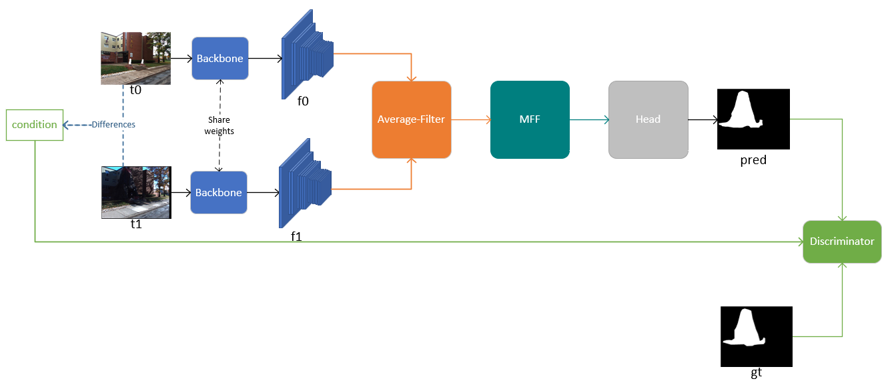
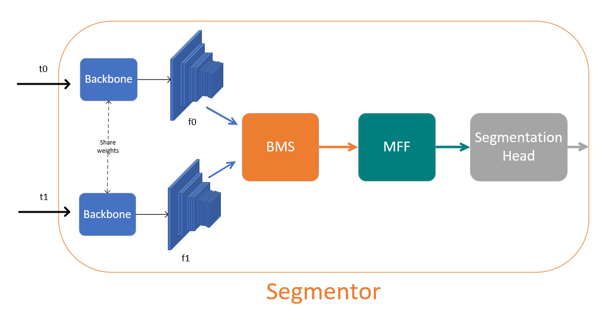
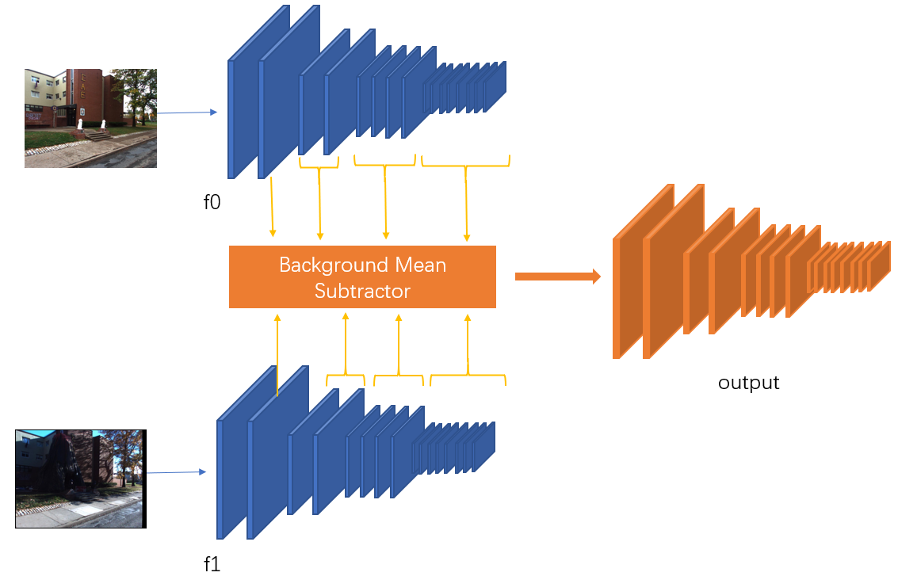
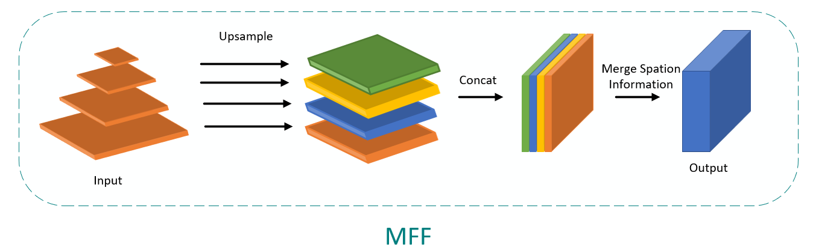

# CDAN
We propose a novel architecture called cDAN to address the challenges of change detection. 


The proposed network comprises two main components: the Segmentor, responsible for extracting key change features and minimizing background noise, and the Conditional Adversarial Module (CAM), which enhances detection performance through discriminative adversarial interaction with the Segmentor. The Segmentor incorporates a Background Mean Subtractor and Multi-Scale Feature Fusion module to effectively handle multiscale targets and reduce noise interference.






our backbone is in ./model/average_filter.py

## Requirements

* Python3
* PyTorch
* Torchvision

## Run

run main.py

## Prepare the dataset

!the folder structure can be:

```
dataset 
├── mask
├── t0
└── t1
```

Please follow this [site](https://kensakurada.github.io/pcd_dataset.html) to download the PCD dataset. You may need to send e-mails to Takayuki Okatani.

For VL-CMU-CD, you can check this [issue](https://github.com/gmayday1997/SceneChangeDet/issues/7).

Please follow this [page](https://github.com/SAMMiCA/ChangeSim) to prepare the ChangeSim dataset.

You can get LEVIR-CD [issue](https://chenhao.in/LEVIR/)

## reference

* https://github.com/leonardoaraujosantos/ChangeNet
* https://github.com/SAMMiCA/ChangeSim
* https://github.com/DoctorKey/C-3PO

